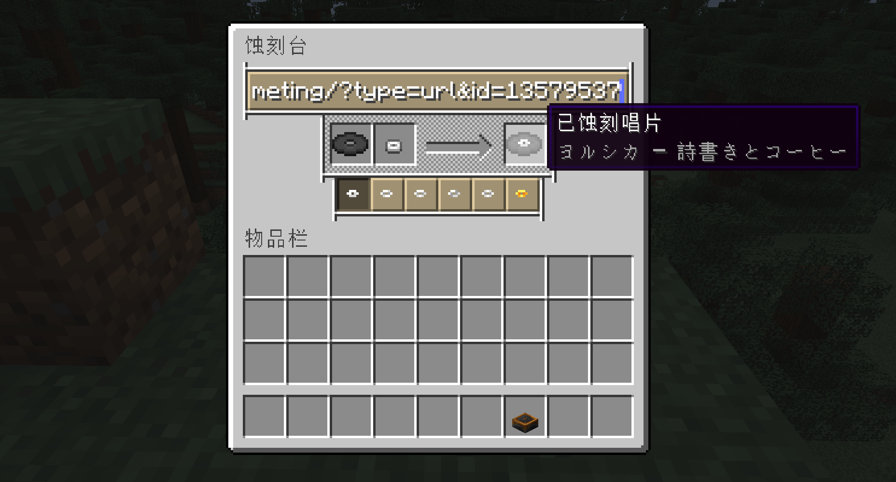

    

---

简体中文 | [English](/docs/README-en.md)

---

为 [Etched](https://github.com/jacksonhardaway/etched) 添加了 [Meting-api](https://github.com/injahow/meting-api)  
与网易云音乐分享链接支持。

网易云音乐使用 [ebnr api](https://github.com/XiYang6666/EvenBetterNeteaseResolver) 解析音乐。

> [!WARNING]
> 默认地址不支持 VIP 歌曲。  
> 使用非 VIP API 时，虽然能成功刻录，但播放时会出现错误。

## 配置

可以在配置文件 `etched_extension-common.toml` 中更改 **ebnr api** 地址.

## 示例

---

## 📜 License

本项目基于 [GPLv3 License](LICENSE) 开源。
