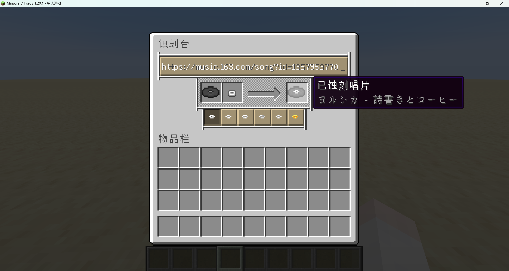

# Etched-Extension

简体中文 | [English](/docs/README-en.md)

---

Adds [Meting-api](https://github.com/injahow/meting-api) and NetEase Cloud Music share link support to [Etched](https://github.com/jacksonhardaway/etched).

NetEase Cloud Music is resolved using [ebnr api](https://github.com/XiYang6666/EvenBetterNeteaseResolver).

> [!WARNING]
> The default API address does not support VIP songs.
> When using a non-VIP API, the burn will succeed, but playback will result in an error.

## Configuration

You can change the **ebnr api** address in the configuration file `etched_extension-common.toml`.

## Example

---

## 📜 License

This project is open-sourced under the [MIT License](LICENSE).

